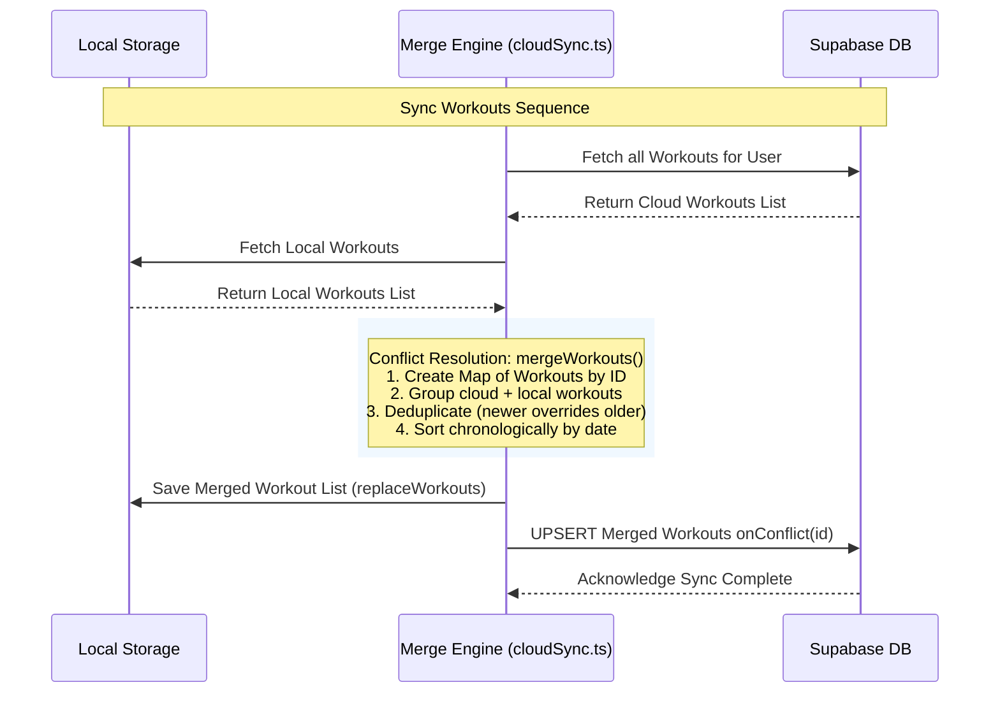

# LiftLog Architecture Specification

This document provides a highly technical, deep-dive specification of LiftLog's architecture, data flows, persistence mechanisms, mathematical algorithms, and external cloud integrations.

---

## 🏗 System Architecture & Layout

LiftLog follows a **Local-First / Server-Optional** architectural pattern. The front-end operates as a heavy, client-side Single Page Application (SPA) inside Next.js App Router framework. It is optimized to perform all core workout logging, metric evaluations, template indexing, and session management offline.

```
┌────────────────────────────────────────────────────────────────────────┐
│                          Next.js SPA UI Layer                          │
│       ┌───────────────┬─────────────────┬─────────────┬───────────┐    │
│       │   Home Tab    │   Metrics Tab   │Templates Tab│Workout Tab│    │
│       └───────┬───────┴────────┬────────┴──────┬──────┴─────┬─────┘    │
└───────────────┼────────────────┼───────────────┼────────────┼──────────┘
                │                │               │            │
                ▼                ▼               ▼            ▼
┌────────────────────────────────────────────────────────────────────────┐
│                        Local Storage Engine                            │
│ ┌────────────────────────────────────────────────────────────────────┐ │
│ │                  useSyncExternalStore Reactive Hub                 │ │
│ └────────────────────────────────┬───────────────────────────────────┘ │
│                                  │ (Custom Event & Tab Broadcasts)     │
│                                  ▼                                     │
│ ┌──────────────┬──────────────────┬──────────────┬───────────────────┐ │
│ │  Workouts    │ Active Sessions  │  Templates   │   Folders & PRs   │ │
│ └──────┬───────┴────────┬─────────┴──────┬───────┴────────┬──────────┘ │
└────────┼────────────────┼────────────────┼────────────────┼────────────┘
         │                │                │                │
         │                └───────┐ ┌──────┘                │
         ▼ (Bi-directional)       ▼ ▼                       ▼ (Auth Listeners)
┌─────────────────────────────────┴──────────────────────────────────────┐
│                    Supabase Sync & Auth Broker                         │
│   ┌─────────────────────────────┐      ┌───────────────────────────┐   │
│   │    Conflict Resolution      │      │    Supabase Auth User     │   │
│   │    & Merge Engine           │      │    Session Observer       │   │
│   └──────────────┬──────────────┘      └─────────────┬─────────────┘   │
└──────────────────┼───────────────────────────────────┼─────────────────┘
                   ▼                                   ▼
┌────────────────────────────────────────────────────────────────────────┐
│                       Supabase Backend Cloud                           │
│  ┌─────────────────────────┐             ┌──────────────────────────┐  │
│  │ PostgreSQL JSONB Tables │             │ Supabase Identity & Auth │  │
│  └─────────────────────────┘             └──────────────────────────┘  │
└────────────────────────────────────────────────────────────────────────┘
```

### Key Subsystems:
1. **Next.js Page Routing:** Layout boundaries configured at `app/layout.tsx` wrap all page nodes with a global layout setting a `max-w-md` frame and attaching the `BottomNav` navigation controller.
2. **Event-Driven Storage Engine (`lib/storage.ts`):** Mediates read/write requests to browser `localStorage`. Employs static memory caches to avoid frequent string parsing, and dispatches custom DOM events (`liftlog-storage`) to synchronize UI states instantly across different React components and open browser tabs.
3. **High-Fidelity Calculation Engine (`lib/calculations.ts`):** Contains pure, testable functional components that consume state objects (completed workouts, catalog databases) to yield hypertrophy aggregates, strength trends, and PRs.
4. **Cloud Broker (`lib/supabase.ts` & `lib/cloudSync.ts`):** Orchestrates network transactions, database updates, and state mapping routines to sync local assets to Supabase once an active JWT user session is detected.

---

## 🔄 Local Storage & Reactive Model

To guarantee instant UI responses, LiftLog decouples its data reads from React's internal component state lifecycle using `useSyncExternalStore`. 

### The Reactive Loop:
1. **Write Action:** A component calls a mutating storage helper, e.g., `saveWorkout(workout)`.
2. **Persistence & Serialization:** `storage.ts` commits the JSON payload to browser `localStorage`.
3. **Dispatch & Notification:** The storage layer fires a local `CustomEvent` (`liftlog-storage`) with the target storage key, and additionally hooks into the native window `'storage'` event to handle changes originating from other open browser tabs.
4. **Reactive Store Trigger:** Active page hooks subscribed via `useSyncExternalStore` catch the event, flush their local caches, re-run selectors, and trigger a surgical rerender of the relevant React components.

```typescript
// Architectural example of the storage subscription pattern
export function subscribeToStorage(callback: () => void) {
  if (typeof window === "undefined") return () => {};
  window.addEventListener("liftlog-storage", callback);
  window.addEventListener("storage", callback); // Handles multi-tab cross-talk
  return () => {
    window.removeEventListener("liftlog-storage", callback);
    window.removeEventListener("storage", callback);
  };
}
```

---

## ⚡ Supabase Integration & Bi-directional Sync

Supabase acts as a durable, secondary replication log. When environment variables are set and the user logs in, LiftLog automatically switches from purely isolated local operations to a hybrid bi-directional synchronization cycle.

### 1. Database Schema (`supabase/schema.sql`)
The cloud schema maps the key local collections into three relational tables equipped with PostgreSQL JSONB types for nested properties (e.g., sets inside exercises) to prevent complex multi-table joins on mobile devices:

* **`workouts`**: Stores completed history.
  ```sql
  create table public.workouts (
    id text primary key,
    user_id uuid not null references auth.users(id) on delete cascade,
    date timestamptz not null,
    exercises jsonb not null,
    total_volume numeric not null default 0,
    prs_achieved jsonb not null default '[]'::jsonb,
    created_at timestamptz not null default now()
  );
  ```
* **`template_folders`**: Stores organization structures.
* **`workout_templates`**: Stores reusable template routines with a foreign key back to `template_folders.id`.

### 2. Security & RLS Policies
All three tables enable Row-Level Security (RLS). The system utilizes Supabase Auth metadata to ensure users can only CRUD their own rows:
```sql
create policy "Users can read their own workouts"
  on public.workouts for select
  using (auth.uid() is not null and auth.uid() = user_id);
```

### 3. Sync & Conflict Resolution Engine (`lib/cloudSync.ts`)
Synchronization is transactionally heavy and is invoked upon auth state changes, explicit "Sync Now" user requests, or whenever new workouts are committed locally. LiftLog implements a specific conflict resolution protocol to handle multi-device data updates:



* **Deduplication strategy for non-timestamped records (Workouts):** Workouts are grouped by unique `id`. In case of a conflict, the engine maintains a unique map where both local and cloud items are merged. Since workouts are mostly immutable once saved, duplicates are collapsed, and the resulting set is ordered descending by workout date.
* **Deduplication strategy for mutable records (Templates & Folders):** Utilizes an explicit `updatedAt` ISO-8601 string property. The merge engine compares `localItem.updatedAt` against `cloudItem.updatedAt`. The item with the higher lexicographical string value is selected, guaranteeing that the most recent modification is preserved across all synchronized devices.

---

## 📈 High-Fidelity Calculations & Math

Training metrics require high mathematical consistency to avoid calculating artificial spikes in hypertrophy volume or strength indexes. LiftLog implements rigorous filters before processing mathematical calculations:

### 1. Qualification Criteria for Weight Metrics
A set must satisfy ALL of the following criteria to be eligible for 1-Rep Max or Volume metrics:
1. `set.completed === true` (Incomplete sets are ignored)
2. `set.isWarmup !== true` (Warm-up sets do not contribute to volume or PRs)
3. `set.weightType === "weight"` (Bodyweight, band, and assisted sets are excluded to prevent mathematically skewed PR calculations)
4. `set.weight > 0` and `set.reps > 0`

### 2. Estimated 1-Rep Max (e1RM) Formula
LiftLog uses a conditional hybrid model to estimate 1RM, leveraging Epley's and modified O'Conner formulas based on rep ranges to ensure mathematical precision:

$$\text{e1RM} = \begin{cases} 
      \text{weight} \times \left(\frac{36}{37 - \text{reps}}\right) & \text{if } \text{reps} \le 6 \\
      \text{weight} \times \left(1 + \frac{\text{reps}}{30}\right) & \text{if } \text{reps} > 6 
   \end{cases}$$

This is coded in `lib/calculations.ts` as:
```typescript
export function estimateOneRepMax(weight: number, reps: number) {
  if (weight <= 0 || reps <= 0) return 0;
  const estimate = reps <= 6 
    ? weight * (36 / (37 - reps)) 
    : weight * (1 + reps / 30);
  return Math.round(estimate * 10) / 10; // Round to 1 decimal place
}
```

### 3. Hypertrophy Muscle-Group Set Tallying
Muscle volume calculations in LiftLog support multi-joint exercise mappings. Sets are aggregated to **both** the `primaryMuscleGroup` and the `additionalPrimaryMuscleGroup` from the exercise catalog:
* **Example:** A completed working set of *Back Squats* (Primary: `Quads`, Additional Primary: `Glutes/Hips`) tallies `1` hard set to Quads and `1` hard set to Glutes/Hips simultaneously. This prevents underestimating structural fatigue on compound movement chains.

---

## 📦 Vercel Deployment & Build Pipeline

The project is structured to deploy smoothly on **Vercel** with zero-configuration server rendering, utilizing dynamic client loading for localStorage compliance:

1. **Local-Storage Safety:** React components that call localStorage are wrapped in hydration guards or loaded inside client-only mounts (`useSyncExternalStore` with fallback suppliers, or inside standard `useEffect` hooks) to prevent Next.js build-time Node.js server errors where `window` is undefined.
2. **Environment Variable Injection:** Vercel automatically reads injected environment credentials (`NEXT_PUBLIC_SUPABASE_URL` and `NEXT_PUBLIC_SUPABASE_ANON_KEY`) during the continuous integration (CI) build step and embeds them in the compiled Javascript bundle.
3. **Zero Cold-Starts:** Because all auth state management and core processing runs on the client-side, the app is extremely fast and cost-efficient to host, loading immediately from Vercel's global Edge CDN networks.
