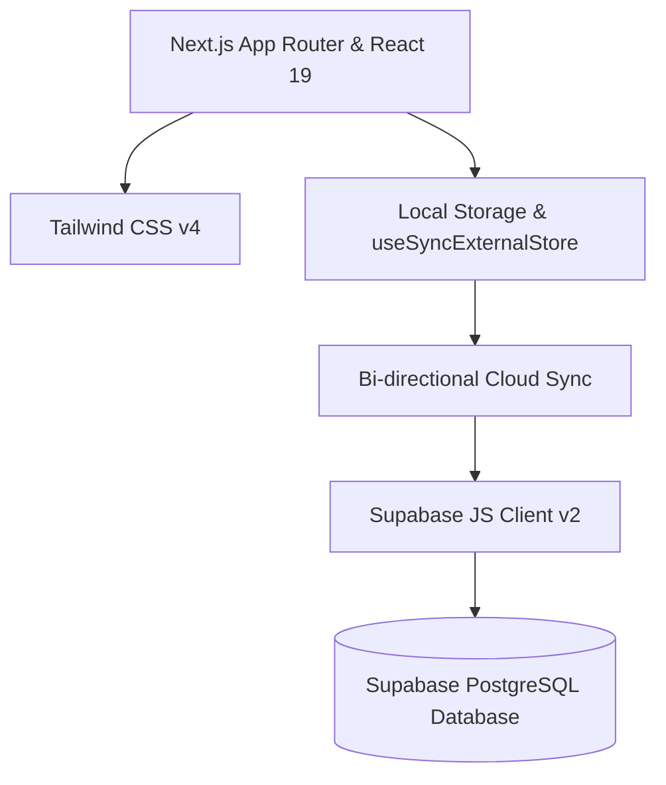

# LiftLog Project Overview

**Current Version:** `v1.7.0`  
**Live URL:** [https://liftlog-weld.vercel.app/](https://liftlog-weld.vercel.app/)  
**Design Paradigm:** Mobile-First, iPhone-Style Workout Tracker (optimally constrained to a sleek, central `max-w-md` frame).

---

## 🏋️‍♂️ What is LiftLog?

**LiftLog** is a lightweight, high-performance, mobile-first workout tracking application designed for progressive overload logging, historical strength metrics, and evidence-based training tracking. The core experience is modeled after premium iOS native applications, utilizing fluid interactions, clear micro-feedback, and an intuitive hierarchy that fits comfortably in one hand while training in the gym.

Unlike cloud-dependent tracking apps that suffer from latency or connection loss in basement weight rooms, LiftLog is **local-first**. It persists all workouts, active sessions, and reusable templates directly in the browser's `localStorage` via reactive, event-driven state sync. When connected to a network and configured with a Supabase cloud database, it silently handles optional bi-directional synchronization and identity authentication.

---

## 🌟 Core Value Propositions

1. **Zero-Latency Gym Experience:** Instant UI responses. No loading spinners while trying to log a finished set.
2. **Offline Resilience:** Fully functional without cell service. Workouts sync automatically to the cloud once an internet connection and credentials are established.
3. **Evidence-Based Metrics:** Automatic calculation of Weekly Hard Sets by muscle group against default scientific hypertrophy targets (6–13 sets depending on muscle group), estimated 1-Rep Max (e1RM) progression charts, and personal record (PR) calculations.
4. **Flexible Set Modeling:** Support for Weighted, Bodyweight, Assistance (weight subtracted, e.g. assisted pull-ups), and Band set entries with integrated RIR (Reps in Reserve) and set-level notes.

---

## 🛠 Tech Stack & Dependencies



* **Core Framework:** Next.js `^16.2.6` (App Router) & React `19.2.4`
* **Styling & Theme:** Tailwind CSS `^4` (utilizing a modern HSL-tailored palette, glassmorphism, rounded-3xl components, and custom animation hooks)
* **Local Storage & State Binding:** Synchronized React hook architecture using `useSyncExternalStore` bound to custom storage events and cross-tab broadcasts.
* **Backend Database & Auth (Optional Cloud Sync):** Supabase Client `^2.105.4` (PostgreSQL with Row-Level Security policies).
* **Development Language:** TypeScript `^5` (Strict type safety across workouts, sets, folders, and PR models).
* **Iconography:** Lucide-React `^0.563.0`

---

## 🚀 Key Functional Modules

### 1. Home Dashboard (`app/page.tsx`)
Focused on immediate training context:
* **7-Day Activity Snapshot:** Dynamic summary of training frequency.
* **State-Aware CTA:** Prominent "Start Workout" or "Resume Workout" (with last-edited indicators).
* **Aggregated Stats Grid:** Real-time metrics for total workouts, hard sets completed, top muscle group trained, and 30-day PR counts.
* **Recent Workouts Roll:** Interactive log of the last 5 completed sessions featuring detailed summaries, muscle-group breakdowns, and PR achievements.

### 2. Active Workout Logger (`app/workout/page.tsx` & `components/ExerciseCard.tsx`)
A fluid interface for tracking exercises:
* **Dynamic Set Builder:** Inline addition of sets, set-type toggles (Warm-up "W" vs. Working Set numbers), RIR logging, and specific set notes.
* **Barbell Bar-Weight Auto-Calculator:** Automatically triggers barbell bar-weight settings (e.g., includes bar weight toggle) for mapped barbell exercises.
* **PR Live Indicators:** Visually flags new estimated 1RM personal records *as they are entered*.
* **Robust Session Recovery:** Auto-saves progress to `activeWorkoutSession` on every keystroke. Supports saving inactive templates as drafts.

### 3. Hypertrophy & Strength Analytics (`app/metrics/page.tsx` & `lib/calculations.ts`)
Scientific insight into progress:
* **Weekly Muscle Volume Tracker:** Tally of completed working sets (including secondary muscle groups) plotted against default scientific target ranges.
* **Sleek E1RM Progression Charts:** Dynamic SVG charting of historical estimated 1-Rep Max values.
* **Strength Performance Matrix:** 30-day E1RM change calculation alongside best sets by rep target (3-rep, 5-rep, 8-rep, 10-rep).

### 4. Template & Folder Architect (`app/templates/page.tsx`)
Reusable structures for programmatic training:
* **Workout Template Creation:** Pre-configure exercises, target set types, weights, reps, and warm-up plans.
* **Folder Grouping:** Categorize templates (e.g., "Push/Pull/Legs", "Upper/Lower") to streamline session selection.
* **Sync-Ready Metadata:** Custom update timestamps for accurate local/cloud conflict resolution.

---

## ⚙️ Quick Start

### Local Development
To run LiftLog on your local machine:

1. **Install Dependencies:**
   ```bash
   npm install
   ```
2. **Configure Environment:** Create a `.env.local` file at the root:
   ```env
   NEXT_PUBLIC_SUPABASE_URL=your_supabase_project_url
   NEXT_PUBLIC_SUPABASE_ANON_KEY=your_supabase_anon_role_key
   ```
3. **Execute Dev Server:**
   ```bash
   npm run dev
   ```
4. **Access the App:** Open [http://localhost:3000](http://localhost:3000) on your desktop or mobile emulator.

### Production Release Routine
Before pushing changes to Vercel production:
1. Run static compilation checks:
   ```bash
   npx tsc --noEmit
   ```
2. Run ESLint checks:
   ```bash
   npm run lint
   ```
3. Execute production bundle test:
   ```bash
   npm run build
   ```
